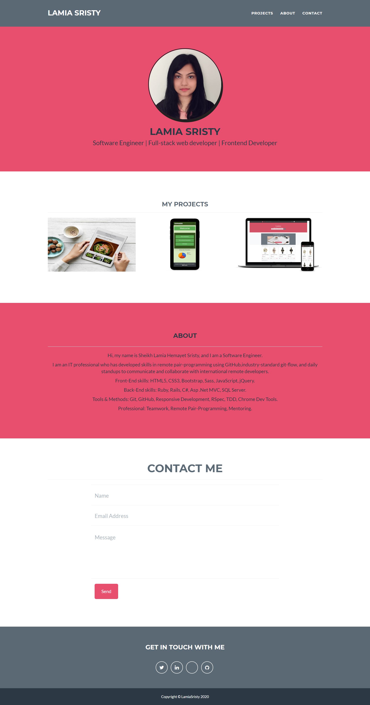

# My Portfolio

# Screenshot


# Built With
- JavaScript 
- HTML 
- CSS
- Ruby
- PHP

**To get this project set up on your local machine, follow these simple steps:**

1. Open Terminal.
2. Navigate to your desired location to download the contents of this repository.
3. Copy and paste the following code into the Terminal: git clone https://github.com/LamiaSristy/lamiasristy.github.io
4. Run ```cd lamiasristy.github.io``.
5. Run ```gem install bundler jekyll```.
6. Run ```bundle update --bundler```.
7. Run ```bundle exec jekyll serve```.

## Author Details::

👤 **Lamia Sristy**

- Github: [@LamiaSristy](https://github.com/LamiaSristy)
- Linkedin: [@LamiaSristy](https://www.linkedin.com/in/lamia-hemayet-sristy/)
- E-mail: <a href="mailto:lamiasristy@gmail.com?subject=Hello Lamia!">Email</a>  
- Twitter: [@LamiaSristy](https://twitter.com/lsristy1)


## Show your support

Give ⭐ Star me on GitHub — it helps!

## 📝 License

This project is [MIT](lic.url) licensed.   